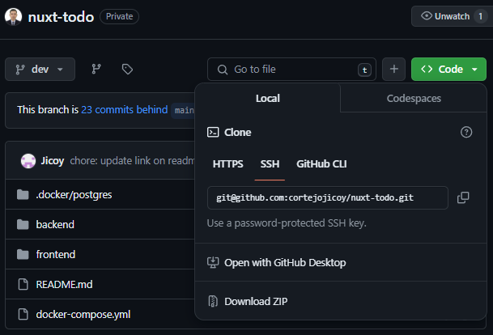

# nuxt-todo

## file structure
```
.docker/
backend/
 ├── app/
 ├── ...
 ├── config/
 ├── .../
 ├── routes/
 ├── .../
 └── tests/
       ├── Feature/
       |     └── SocialAuthTest.js
       ...
    .env
    Dockerfile

frontend/
 ├── components/
 ├── .../
 ├── middleware/
 |     └── auth.ts
 ├── pages/
 |     ├── auth/
 |     |     └── callback.vue
 |     ├── dashboard.vue
 |     └── index.vue
 ├── .../
 ├── shared/
 |     └── api.ts
 └── store/
       ├── actions
       |     └── authActions.js
       ├── reducers
       |     └── authSlice.js
       └── store.js
docker-compose.yml
```




## Installation

- #### copy the `ssh` link refer the image above
- #### create a workstation folder on your local
- #### perform git cli for `remote` -> `fetch` -> `pull` using copy link ssh


> **Note**
>
> make sure you have [Composer](https://getcomposer.org/download/) installed on local; [Git](https://git-scm.com/downloads); IDE (VSCode)
> then inside `backend` folder run `composer install`

## Once all codes are copied on local; lets configure first the `backend`

- #### copy env files from example
```
docker compose exec app cp .env.example .env
```
- #### run/build the docker 
```
docker compose --env-file ./backend/.env up -d
```
- #### after the build run this in-sequence
```
docker compose exec app php artisan key:generate
docker compose exec app chmod -R 777 storage bootrap/cache
docker compose exec app php artisan migrate
```
## lets configure the `frontend` 
- #### do npm install inside `frontend` folder
```
npm install
```

> **Note**
>
> Node Version 19.6.0 (npm v9.6.6)

- #### run the `frontend` via
```
npm run dev
```

## To use GitHub Login refer to this [docs](https://laravel.com/docs/11.x/socialite)


# Demo App


